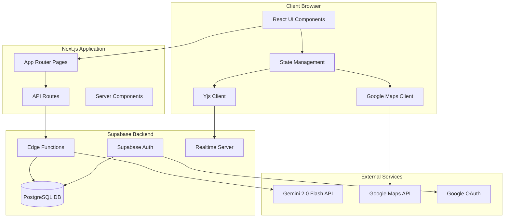

# Design Document: TripAI Travel Planner

## Overview

TripAI is an enterprise-grade AI-powered travel planning application built with Next.js 15, React, Supabase, and Google Gemini 2.0 Flash. The system enables users to create personalized travel itineraries through natural language interaction, visualize destinations on Google Maps, and collaborate in real-time with other travelers.

The architecture follows the Single Responsibility Principle (SRP) with clear separation between presentation, business logic, data access, and external integrations. The application uses a layered architecture pattern with:

- **Presentation Layer**: React components with Gen Z-styled UI/UX
- **Application Layer**: Business logic and state management
- **Integration Layer**: API clients for Gemini, Google Maps, and Supabase
- **Data Layer**: Supabase database and real-time synchronization

Key technical decisions:
- **Supabase Cloud Service**: Using Supabase hosted cloud service (not self-hosted), which automatically handles OAuth callbacks, session management, and database triggers
- **Streaming AI responses** via Supabase Edge Functions for real-time user feedback
- **CRDT-based collaboration** using Yjs for conflict-free concurrent editing
- **Domain-restricted API keys** for secure Google Maps integration
- **In-memory session management** for chat history without database persistence
- **Modular architecture** to support future monetization features

### Deployment Architecture

**Backend Infrastructure:**
- **Supabase Cloud**: Fully managed Supabase instance hosted at `https://[project-id].supabase.co`
  - PostgreSQL database with automatic backups
  - Built-in authentication with OAuth providers
  - Real-time subscriptions via WebSocket
  - Edge Functions (Deno runtime) for serverless compute
  - Automatic SSL/TLS certificates
  - Global CDN for static assets

**Authentication Flow (Simplified with Supabase Cloud):**
- OAuth callbacks are handled by Supabase's authentication service at `https://[project-id].supabase.co/auth/v1/callback`
- Supabase automatically exchanges OAuth codes for sessions
- Database triggers automatically create user profiles on signup
- Client-side callback page (`/auth/callback`) only needs to redirect to home page
- No need for complex server-side OAuth handling in Next.js API routes

## Architecture

### System Architecture Diagram



### Layered Architecture

**Layer 1: Presentation (Client-Side)**
- React components organized by feature
- Shared UI components library
- Theme provider for dark/light mode
- Responsive layouts for mobile/desktop

**Layer 2: Application Logic**
- Custom hooks for business logic
- State management (React Context + hooks)
- Client-side validation
- Session management

**Layer 3: Integration**
- Supabase client wrapper
- Gemini API client (via Edge Functions)
- Google Maps SDK wrapper
- Yjs provider configuration

**Layer 4: Data Access**
- Supabase database schema
- Real-time subscriptions
- CRDT document management
- Local storage for preferences

### Technology Stack

**Frontend:**
- Next.js 15 (App Router)
- React 18
- TypeScript
- Tailwind CSS
- Shadcn/ui components
- Yjs + y-websocket
- @react-google-maps/api

**Backend:**
- Supabase (PostgreSQL, Auth, Realtime, Edge Functions)
- Deno runtime (Edge Functions)
- Google Gemini 2.0 Flash API

**Development:**
- ESLint + Prettier
- Vitest for testing
- Fast-check for property-based testing

## Components and Interfaces

### Frontend Component Structure

```
src/
├── app/                          # Next.js App Router
│   ├── (auth)/                   # Auth group
│   │   ├── login/
│   │   └── callback/
│   ├── (main)/                   # Main app group
│   │   ├── layout.tsx
│   │   ├── page.tsx              # Landing page
│   │   └── plan/
│   │       └── [id]/
│   │           └── page.tsx      # Planning interface
│   └── api/                      # API routes
│       └── yjs/
│           └── route.ts          # Yjs WebSocket proxy
├── components/                   # React components
│   ├── ui/                       # Shared UI components
│   │   ├── button.tsx
│   │   ├── input.tsx
│   │   ├── card.tsx
│   │   └── theme-toggle.tsx
│   ├── landing/                  # Landing page components
│   │   ├── hero-section.tsx
│   │   └── trip-form.tsx
│   ├── planner/                  # Planning interface components
│   │   ├── itinerary-panel.tsx
│   │   ├── day-section.tsx
│   │   ├── activity-item.tsx
│   │   ├── map-panel.tsx
│   │   └── chat-panel.tsx
│   └── layout/                   # Layout components
│       ├── header.tsx
│       └── mobile-nav.tsx
├── lib/                          # Core libraries
│   ├── supabase/                 # Supabase integration
│   │   ├── client.ts
│   │   ├── auth.ts
│   │   └── database.types.ts
│   ├── gemini/                   # Gemini integration
│   │   ├── client.ts
│   │   ├── streaming.ts
│   │   └── parser.ts
│   ├── maps/                     # Google Maps integration
│   │   ├── client.ts
│   │   └── geocoding.ts
│   ├── collaboration/            # Yjs collaboration
│   │   ├── provider.ts
│   │   ├── awareness.ts
│   │   └── types.ts
│   └── utils/                    # Utility functions
│       ├── validation.ts
│       └── formatting.ts
├── hooks/                        # Custom React hooks
│   ├── use-auth.ts
│   ├── use-itinerary.ts
│   ├── use-chat.ts
│   ├── use-collaboration.ts
│   └── use-theme.ts
├── types/                        # TypeScript types
│   ├── itinerary.ts
│   ├── chat.ts
│   └── user.ts
└── styles/                       # Global styles
    └── globals.css
```

### Backend Structure (Supabase)

```
supabase/
├── migrations/                   # Database migrations
│   └── 001_initial_schema.sql
├── functions/                    # Edge Functions
│   ├── generate-itinerary/
│   │   └── index.ts
│   ├── chat/
│   │   └── index.ts
│   └── _shared/
│       ├── gemini-client.ts
│       └── cors.ts
└── config.toml                   # Supabase configuration
```

### Core Interfaces

#### Itinerary Data Model

```typescript
interface Itinerary {
  id: string;
  user_id: string;
  title: string;
  destination: string;
  start_date: string;
  end_date: string;
  days: Day[];
  created_at: string;
  updated_at: string;
  shared_with: string[];  // User IDs for collaboration
}

interface Day {
  day_number: number;
  date: string;
  activities: Activity[];
}

interface Activity {
  id: string;
  time: string;
  title: string;
  description: string;
  location: Location;
  duration_minutes: number;
  order: number;
}

interface Location {
  name: string;
  address: string;
  lat: number;
  lng: number;
  place_id?: string;  // Google Maps Place ID
}
```

#### Chat Session Model

```typescript
interface ChatSession {
  session_id: string;
  messages: ChatMessage[];
  itinerary_context: Itinerary | null;
}

interface ChatMessage {
  id: string;
  role: 'user' | 'assistant';
  content: string;
  timestamp: number;
  streaming?: boolean;
}

interface StreamingResponse {
  chunk: string;
  done: boolean;
  metadata?: {
    itinerary_updates?: Partial<Itinerary>;
  };
}
```

#### Collaboration Model

```typescript
interface CollaborationSession {
  room_id: string;  // Same as itinerary_id
  doc: Y.Doc;       // Yjs document
  provider: WebsocketProvider;
}

interface UserPresence {
  user_id: string;
  name: string;
  online: boolean;
}
```

### Component Responsibilities

#### Landing Page Components

**HeroSection**
- Display Gen Z-styled hero with theme toggle
- Render marketing copy and call-to-action
- Handle theme mode switching

**TripForm**
- Collect destination, trip duration, and custom requirements
- Display custom requirements input as a larger textarea
- Position custom requirements below destination and duration inputs
- Validate user inputs (destination required, custom requirements optional)
- Submit to itinerary generation endpoint
- Display loading state during generation
- Initialize StreamingJSONParser for progressive parsing
- Update UI progressively as partial JSON is parsed
- Display parsed itinerary data immediately when available

#### Planning Interface Components

**ItineraryPanel** (Left Panel)
- Display day-by-day itinerary structure
- Handle expand/collapse of day sections
- Manage drag-and-drop reordering
- Sync changes to Yjs document

**DaySection**
- Render activities for a specific day
- Handle day-level expand/collapse
- Display day summary (date, activity count)

**ActivityItem**
- Display single activity details
- Provide drag handle for reordering
- Handle click to highlight on map
- Show edit/delete actions

**MapPanel** (Center Panel)
- Initialize Google Maps instance
- Render location pins for all activities
- Handle pin click to show details
- Update map when itinerary changes
- Provide navigation links for mobile

**ChatPanel** (Right Panel, Collapsible)
- Display chat message history
- Handle user message input
- Stream AI responses in real-time
- Parse and apply itinerary updates
- Maintain scroll position

#### Shared UI Components

**ThemeToggle**
- Switch between light/dark mode
- Persist preference to local storage
- Apply theme to document root

**Button, Input, Card**
- Reusable UI primitives
- Support theme variants
- Follow Gen Z design principles

### API Endpoints

#### Authentication Flow (Supabase Cloud)

**Important Note: Using Supabase Cloud Service**

This application uses **Supabase's hosted cloud service**, which significantly simplifies the OAuth authentication flow. Unlike self-hosted solutions, Supabase Cloud automatically handles:

1. **OAuth Callback Processing**
   - Supabase's authentication service at `https://[project-id].supabase.co/auth/v1/callback` handles all OAuth callbacks
   - Automatically exchanges authorization codes for access tokens
   - Sets secure HTTP-only cookies for session management
   - No need for custom server-side OAuth handling in Next.js

2. **Session Management**
   - Sessions are automatically stored in browser localStorage
   - Tokens are automatically refreshed before expiration
   - Session state is synchronized across tabs

3. **User Profile Creation**
   - Database trigger (`handle_new_user()`) automatically creates profiles on signup
   - Triggered at the database level when new users are inserted into `auth.users`
   - No need for manual profile creation in application code

**Simplified Authentication Architecture:**

```
User clicks "Sign in with Google"
    ↓
Frontend: supabase.auth.signInWithOAuth({ provider: 'google' })
    ↓
Redirect to Google OAuth
    ↓
User authorizes
    ↓
Google redirects to: https://[project-id].supabase.co/auth/v1/callback?code=xxx
    ↓
Supabase Cloud automatically:
  - Exchanges code for tokens
  - Creates session
  - Sets cookies
  - Triggers database trigger (creates profile)
    ↓
Redirects to: https://your-domain.com/auth/callback
    ↓
Client-side callback page (app/auth/callback/page.tsx):
  - Shows loading animation
  - Redirects to home page
    ↓
useAuth hook detects session change
    ↓
User is logged in ✅
```

**Client-Side Callback Page:**

```typescript
// app/auth/callback/page.tsx
'use client';

export default function AuthCallbackPage() {
  const router = useRouter();

  useEffect(() => {
    // Supabase has already handled everything
    // Session is already in localStorage
    // Just redirect to home
    router.push('/');
  }, [router]);

  return <LoadingSpinner />;
}
```

**Key Benefits of Supabase Cloud:**
- ✅ No server-side OAuth code exchange needed
- ✅ No manual session management
- ✅ No manual profile creation
- ✅ Automatic security best practices
- ✅ Simplified codebase (~20 lines vs ~80 lines)

#### Next.js API Routes

**POST /api/yjs**
- WebSocket proxy for Yjs collaboration
- Handle connection upgrades
- Route messages to Supabase Realtime

#### Supabase Edge Functions

**IMPORTANT: Direct URL Invocation for Streaming Support**

⚠️ **Critical Implementation Note:**

When calling Supabase Edge Functions from the frontend to support streaming responses, you **MUST** use direct URL invocation with `fetch()` instead of the Supabase client's `invoke()` method.

**Why:**
- The `supabase.functions.invoke()` method does NOT support streaming responses
- It waits for the complete response before returning
- This defeats the purpose of streaming and causes poor UX

**Correct Implementation:**

```typescript
// ✅ CORRECT: Direct URL with fetch() for streaming
const supabaseUrl = process.env.NEXT_PUBLIC_SUPABASE_URL;
const { data: { session } } = await supabase.auth.getSession();

const response = await fetch(
  `${supabaseUrl}/functions/v1/generate-itinerary`,
  {
    method: 'POST',
    headers: {
      'Content-Type': 'application/json',
      'Authorization': `Bearer ${session?.access_token || anonKey}`,
    },
    body: JSON.stringify({
      destination,
      duration,
      custom_requirements,
    }),
  }
);

// Read streaming response
const reader = response.body.getReader();
const decoder = new TextDecoder();

while (true) {
  const { done, value } = await reader.read();
  if (done) break;
  
  const chunk = decoder.decode(value, { stream: true });
  // Process chunk...
}
```

**Incorrect Implementation:**

```typescript
// ❌ WRONG: Does NOT support streaming
const { data, error } = await supabase.functions.invoke(
  'generate-itinerary',
  { body: { destination, duration } }
);
// This waits for complete response, no streaming!
```

**Authentication Requirements:**

1. **With User Session (Recommended):**
   - Use `session.access_token` from authenticated user
   - Provides user context to Edge Function
   - Enables RLS policies

2. **Without User Session (Anonymous):**
   - Use `NEXT_PUBLIC_SUPABASE_ANON_KEY`
   - Limited by RLS policies
   - Suitable for public endpoints

**Example with Error Handling:**

```typescript
async function callEdgeFunctionWithStreaming() {
  const supabaseUrl = process.env.NEXT_PUBLIC_SUPABASE_URL;
  const supabaseKey = process.env.NEXT_PUBLIC_SUPABASE_ANON_KEY;
  
  if (!supabaseUrl || !supabaseKey) {
    throw new Error('Supabase configuration missing');
  }

  // Get session token if user is logged in
  const { data: { session } } = await supabase.auth.getSession();
  const authToken = session?.access_token || supabaseKey;

  const response = await fetch(
    `${supabaseUrl}/functions/v1/generate-itinerary`,
    {
      method: 'POST',
      headers: {
        'Content-Type': 'application/json',
        'Authorization': `Bearer ${authToken}`,
      },
      body: JSON.stringify({ destination, duration }),
    }
  );

  if (!response.ok) {
    throw new Error(`HTTP ${response.status}: ${response.statusText}`);
  }

  return response.body; // Return readable stream
}
```

**Security Notes:**
- Always include `Authorization` header with Bearer token
- Use session token for authenticated requests
- Use anon key only for public endpoints
- Edge Functions validate tokens server-side

---

**POST /functions/v1/generate-itinerary**
- Accept: destination, duration, custom_requirements
- Call Gemini API with structured prompt including custom requirements
- Stream response chunks to client
- Parse AI response into Itinerary structure
- Return: StreamingResponse

**POST /functions/v1/chat**
- Accept: message, session history, itinerary context
- Call Gemini API with conversation history
- Stream response chunks to client
- Detect itinerary modification intents
- Return: StreamingResponse with optional updates

### Integration Layer

#### Gemini Client

```typescript
class GeminiClient {
  async generateItinerary(
    destination: string,
    duration: number,
    customRequirements?: string
  ): AsyncGenerator<StreamingResponse> {
    // Build structured prompt with custom requirements
    // Call Gemini API with streaming
    // Yield chunks as they arrive
    // Parse final response into Itinerary
  }

  async chat(
    message: string,
    history: ChatMessage[],
    context: Itinerary | null
  ): AsyncGenerator<StreamingResponse> {
    // Build conversation prompt with context
    // Call Gemini API with streaming
    // Yield chunks as they arrive
    // Detect and parse itinerary updates
  }
}
```

#### Streaming JSON Parser

```typescript
class StreamingJSONParser {
  private buffer: string = "";
  private bracketStack: string[] = [];
  
  /**
   * Append new chunk to buffer and attempt to parse
   */
  appendChunk(chunk: string): Partial<Itinerary> | null {
    this.buffer += chunk;
    return this.tryParse();
  }
  
  /**
   * Try to parse incomplete JSON by auto-closing brackets
   */
  private tryParse(): Partial<Itinerary> | null {
    // Track bracket balance
    const balanced = this.checkBracketBalance(this.buffer);
    
    if (balanced.isComplete) {
      // JSON is complete, parse normally
      return this.parseComplete(this.buffer);
    } else {
      // JSON is incomplete, try auto-closing
      const completed = this.autoCloseBrackets(this.buffer, balanced);
      return this.parsePartial(completed);
    }
  }
  
  /**
   * Check bracket balance and track unclosed brackets
   */
  private checkBracketBalance(json: string): BracketBalance {
    const stack: string[] = [];
    let inString = false;
    let escapeNext = false;
    
    for (let i = 0; i < json.length; i++) {
      const char = json[i];
      
      if (escapeNext) {
        escapeNext = false;
        continue;
      }
      
      if (char === '\\') {
        escapeNext = true;
        continue;
      }
      
      if (char === '"' && !escapeNext) {
        inString = !inString;
        continue;
      }
      
      if (!inString) {
        if (char === '{' || char === '[') {
          stack.push(char);
        } else if (char === '}' || char === ']') {
          stack.pop();
        }
      }
    }
    
    return {
      isComplete: stack.length === 0,
      unclosedBrackets: stack,
    };
  }
  
  /**
   * Auto-close unclosed brackets to make valid JSON
   */
  private autoCloseBrackets(json: string, balance: BracketBalance): string {
    let completed = json;
    
    // Close unclosed brackets in reverse order
    for (let i = balance.unclosedBrackets.length - 1; i >= 0; i--) {
      const bracket = balance.unclosedBrackets[i];
      completed += bracket === '{' ? '}' : ']';
    }
    
    return completed;
  }
  
  /**
   * Parse complete JSON
   */
  private parseComplete(json: string): Partial<Itinerary> | null {
    try {
      // Remove markdown code blocks if present
      const cleaned = this.cleanJSON(json);
      return JSON.parse(cleaned);
    } catch (error) {
      return null;
    }
  }
  
  /**
   * Parse partial JSON (may be incomplete)
   */
  private parsePartial(json: string): Partial<Itinerary> | null {
    try {
      const cleaned = this.cleanJSON(json);
      const parsed = JSON.parse(cleaned);
      
      // Return partial data even if incomplete
      return {
        title: parsed.title,
        destination: parsed.destination,
        days: parsed.days || [],
      };
    } catch (error) {
      // If parsing fails, return null and wait for more data
      return null;
    }
  }
  
  /**
   * Clean JSON by removing markdown code blocks
   */
  private cleanJSON(json: string): string {
    let cleaned = json.trim();
    
    if (cleaned.startsWith('```json')) {
      cleaned = cleaned.replace(/^```json\s*/, '').replace(/\s*```$/, '');
    } else if (cleaned.startsWith('```')) {
      cleaned = cleaned.replace(/^```\s*/, '').replace(/\s*```$/, '');
    }
    
    return cleaned;
  }
  
  /**
   * Get the complete buffer
   */
  getBuffer(): string {
    return this.buffer;
  }
  
  /**
   * Reset the parser
   */
  reset(): void {
    this.buffer = "";
    this.bracketStack = [];
  }
}

interface BracketBalance {
  isComplete: boolean;
  unclosedBrackets: string[];
}

/**
 * Usage Example:
 */
async function handleStreamingItinerary() {
  const parser = new StreamingJSONParser();
  const response = await fetch('/functions/v1/generate-itinerary', {
    method: 'POST',
    body: JSON.stringify({ destination: 'Tokyo', duration: 3 })
  });
  
  const reader = response.body.getReader();
  const decoder = new TextDecoder();
  
  while (true) {
    const { done, value } = await reader.read();
    if (done) break;
    
    const chunk = decoder.decode(value, { stream: true });
    
    // Try to parse partial JSON
    const partialItinerary = parser.appendChunk(chunk);
    
    if (partialItinerary) {
      // Update UI immediately with available data
      updateItineraryUI(partialItinerary);
    }
  }
  
  // Final parse with complete data
  const finalItinerary = parser.parseComplete(parser.getBuffer());
  updateItineraryUI(finalItinerary);
}
```

#### Google Maps Client

```typescript
class MapsClient {
  async geocode(address: string): Promise<Location> {
    // Call Google Geocoding API
    // Return lat/lng coordinates
  }

  async getPlaceDetails(placeId: string): Promise<PlaceDetails> {
    // Call Google Places API
    // Return detailed place information
  }

  createNavigationLink(location: Location): string {
    // Generate Google Maps navigation URL
    // Support both web and mobile app links
  }
}
```

#### Yjs Provider

```typescript
class CollaborationProvider {
  initializeRoom(itineraryId: string): CollaborationSession {
    // Create Yjs document
    // Connect to WebSocket provider
    // Bind to itinerary state
  }

  syncItinerary(doc: Y.Doc, itinerary: Itinerary): void {
    // Convert Itinerary to Yjs types
    // Apply changes to shared document
  }

  observeChanges(doc: Y.Doc, callback: (itinerary: Itinerary) => void): void {
    // Listen for Yjs document changes
    // Convert Yjs types back to Itinerary
    // Invoke callback with updated itinerary
  }

  getOnlineUsers(doc: Y.Doc): UserPresence[] {
    // Get list of currently connected users
    // Return basic presence information (user_id, name, online status)
  }
}
```

## Data Models

### Database Schema

```sql
-- Users table (managed by Supabase Auth)
-- Extended with custom profile data

CREATE TABLE profiles (
  id UUID PRIMARY KEY REFERENCES auth.users(id),
  email TEXT NOT NULL,
  full_name TEXT,
  avatar_url TEXT,
  tier TEXT DEFAULT 'free' CHECK (tier IN ('free', 'pro')),
  credits INTEGER DEFAULT 0,
  created_at TIMESTAMPTZ DEFAULT NOW(),
  updated_at TIMESTAMPTZ DEFAULT NOW()
);

-- Itineraries table
CREATE TABLE itineraries (
  id UUID PRIMARY KEY DEFAULT gen_random_uuid(),
  user_id UUID NOT NULL REFERENCES profiles(id) ON DELETE CASCADE,
  title TEXT NOT NULL,
  destination TEXT NOT NULL,
  start_date DATE NOT NULL,
  end_date DATE NOT NULL,
  data JSONB NOT NULL,  -- Full itinerary structure
  created_at TIMESTAMPTZ DEFAULT NOW(),
  updated_at TIMESTAMPTZ DEFAULT NOW(),
  
  CONSTRAINT valid_dates CHECK (end_date >= start_date)
);

-- Index for user's itineraries
CREATE INDEX idx_itineraries_user_id ON itineraries(user_id);
CREATE INDEX idx_itineraries_created_at ON itineraries(created_at DESC);

-- Itinerary sharing for collaboration
CREATE TABLE itinerary_shares (
  id UUID PRIMARY KEY DEFAULT gen_random_uuid(),
  itinerary_id UUID NOT NULL REFERENCES itineraries(id) ON DELETE CASCADE,
  shared_with_user_id UUID NOT NULL REFERENCES profiles(id) ON DELETE CASCADE,
  permission TEXT DEFAULT 'edit' CHECK (permission IN ('view', 'edit')),
  created_at TIMESTAMPTZ DEFAULT NOW(),
  
  UNIQUE(itinerary_id, shared_with_user_id)
);

CREATE INDEX idx_shares_user_id ON itinerary_shares(shared_with_user_id);

-- Row Level Security (RLS) Policies

-- Profiles: Users can read their own profile
CREATE POLICY "Users can view own profile"
  ON profiles FOR SELECT
  USING (auth.uid() = id);

-- Profiles: Users can update their own profile
CREATE POLICY "Users can update own profile"
  ON profiles FOR UPDATE
  USING (auth.uid() = id);

-- Itineraries: Users can view their own itineraries
CREATE POLICY "Users can view own itineraries"
  ON itineraries FOR SELECT
  USING (auth.uid() = user_id);

-- Itineraries: Users can view shared itineraries
CREATE POLICY "Users can view shared itineraries"
  ON itineraries FOR SELECT
  USING (
    EXISTS (
      SELECT 1 FROM itinerary_shares
      WHERE itinerary_id = itineraries.id
      AND shared_with_user_id = auth.uid()
    )
  );

-- Itineraries: Users can insert their own itineraries
CREATE POLICY "Users can create itineraries"
  ON itineraries FOR INSERT
  WITH CHECK (auth.uid() = user_id);

-- Itineraries: Users can update their own itineraries
CREATE POLICY "Users can update own itineraries"
  ON itineraries FOR UPDATE
  USING (auth.uid() = user_id);

-- Itineraries: Users can update shared itineraries with edit permission
CREATE POLICY "Users can update shared itineraries"
  ON itineraries FOR UPDATE
  USING (
    EXISTS (
      SELECT 1 FROM itinerary_shares
      WHERE itinerary_id = itineraries.id
      AND shared_with_user_id = auth.uid()
      AND permission = 'edit'
    )
  );

-- Itineraries: Users can delete their own itineraries
CREATE POLICY "Users can delete own itineraries"
  ON itineraries FOR DELETE
  USING (auth.uid() = user_id);

-- Free tier limit: Maximum 3 itineraries
CREATE OR REPLACE FUNCTION check_itinerary_limit()
RETURNS TRIGGER AS $$
BEGIN
  IF (
    SELECT tier FROM profiles WHERE id = NEW.user_id
  ) = 'free' THEN
    IF (
      SELECT COUNT(*) FROM itineraries WHERE user_id = NEW.user_id
    ) >= 3 THEN
      RAISE EXCEPTION 'Free tier users can only create 3 itineraries';
    END IF;
  END IF;
  RETURN NEW;
END;
$$ LANGUAGE plpgsql;

CREATE TRIGGER enforce_itinerary_limit
  BEFORE INSERT ON itineraries
  FOR EACH ROW
  EXECUTE FUNCTION check_itinerary_limit();

-- Enable Realtime for collaboration
ALTER PUBLICATION supabase_realtime ADD TABLE itineraries;
```

### Local Storage Schema

```typescript
// Theme preference
interface ThemePreference {
  mode: 'light' | 'dark' | 'system';
}
// Key: 'tripai:theme'

// Session state (cleared on page refresh)
interface SessionState {
  session_id: string;
  chat_history: ChatMessage[];
  current_itinerary_id: string | null;
}
// Key: 'tripai:session' (sessionStorage, not localStorage)
```

### Yjs Document Structure

```typescript
// Yjs document mirrors the Itinerary structure
// Using Y.Map for objects and Y.Array for lists

const doc = new Y.Doc();
const itineraryMap = doc.getMap('itinerary');

// Structure:
// itinerary: Y.Map {
//   id: string
//   title: string
//   destination: string
//   start_date: string
//   end_date: string
//   days: Y.Array<Y.Map> [
//     {
//       day_number: number
//       date: string
//       activities: Y.Array<Y.Map> [
//         {
//           id: string
//           time: string
//           title: string
//           description: string
//           location: Y.Map { name, address, lat, lng }
//           duration_minutes: number
//           order: number
//         }
//       ]
//     }
//   ]
// }
```

## Correctness Properties

*A property is a characteristic or behavior that should hold true across all valid executions of a system—essentially, a formal statement about what the system should do. Properties serve as the bridge between human-readable specifications and machine-verifiable correctness guarantees.*


### Property Reflection

After analyzing all testable acceptance criteria, I identified several areas where properties can be consolidated:

**Consolidation Opportunities:**

1. **Authentication Properties (1.2, 1.4, 1.5)**: These can be combined into comprehensive authentication lifecycle properties
2. **Streaming Properties (3.2, 8.2, 18.1)**: All relate to streaming behavior and can be unified
3. **Theme Properties (2.5, 13.1, 13.2, 13.4)**: Theme management can be tested as a round-trip property
4. **Map Synchronization (6.1, 6.3, 7.3)**: These all test itinerary-map synchronization and can be combined
5. **Session Management (9.1, 9.2, 9.3, 9.4, 9.5)**: Session lifecycle can be tested comprehensively
6. **Collaboration Properties (11.1, 11.2, 11.3, 11.4, 11.5)**: Yjs collaboration can be tested as integrated properties
7. **Persistence Round-trips (10.3, 13.2)**: Both test save-load cycles

**Properties to Keep Separate:**
- Input validation (2.3) - distinct from other validation
- Drag-drop reordering (7.2, 7.4, 7.5) - each tests different aspects
- Error handling (17.1, 17.4, 17.5) - different error scenarios
- API key security (14.4, 14.5) - security-critical properties

### Correctness Properties

**Property 1: Authentication Profile Management**
*For any* successful authentication, creating or retrieving a user profile should result in a valid profile record linked to the authenticated user ID, and subsequent authentications should retrieve the same profile.
**Validates: Requirements 1.2**

**Property 2: Session Persistence Across Refreshes**
*For any* authenticated user, the session state should persist across page refreshes until explicit sign-out.
**Validates: Requirements 1.4**

**Property 3: Sign-out Cleanup**
*For any* authenticated user, signing out should clear all session data and authentication state.
**Validates: Requirements 1.5**

**Property 4: Input Validation Rejects Empty Values**
*For any* input string composed entirely of whitespace or empty, the validation should reject it and prevent form submission.
**Validates: Requirements 2.5**

**Property 5: Theme Toggle Round-trip**
*For any* theme mode selection (light/dark), toggling the theme should save to local storage, and reloading the page should restore the same theme preference.
**Validates: Requirements 2.7, 13.1, 13.2, 13.4**

**Property 6: Gemini API Request Context Inclusion**
*For any* user message sent to the chat, the Edge Function should include the complete conversation history, current itinerary context, and custom requirements in the API request.
**Validates: Requirements 3.1, 3.2, 8.1**

**Property 7: Streaming Response Delivery**
*For any* AI-generated response, the system should stream response chunks to the frontend as they are received, maintaining chunk order and completeness.
**Validates: Requirements 3.3, 8.2, 18.1**

**Property 8: Itinerary Parsing Completeness**
*For any* valid AI response containing itinerary data, parsing should extract all days, activities, locations, and times into the structured Itinerary format without data loss.
**Validates: Requirements 3.4**

**Property 9: Session Memory Storage**
*For any* generated itinerary or chat message, the data should be stored in session memory (not database) and accessible throughout the session.
**Validates: Requirements 3.6, 8.5**

**Property 10: Chat Panel Toggle State**
*For any* chat panel state (expanded/collapsed), clicking the toggle should switch to the opposite state consistently.
**Validates: Requirements 4.4**

**Property 11: Day Section Expand/Collapse**
*For any* day section in the itinerary, clicking the header should toggle between expanded and collapsed states.
**Validates: Requirements 5.2**

**Property 12: Activity Display Completeness**
*For any* activity rendered in the UI, the display should include time, location name, and description fields.
**Validates: Requirements 5.5**

**Property 13: Map Pin Placement**
*For any* itinerary with N activities, loading the itinerary should place exactly N pins on the map at the correct coordinates.
**Validates: Requirements 6.1**

**Property 14: Pin Click Details Display**
*For any* pin on the map, clicking it should display a popup containing the corresponding location details.
**Validates: Requirements 6.2**

**Property 15: Itinerary-Map Synchronization**
*For any* itinerary modification (reordering, adding, removing activities), the map pins should update to reflect the new state, maintaining correspondence between itinerary items and pins.
**Validates: Requirements 6.3, 7.3**

**Property 16: Drag-Drop Reordering**
*For any* activity dragged to a new position within the same day, the itinerary order should update immediately with the activity at the new position.
**Validates: Requirements 7.2**

**Property 17: Cross-Day Activity Movement**
*For any* activity moved from one day to another, the activity should be removed from the source day and added to the target day, updating day groupings correctly.
**Validates: Requirements 7.4**

**Property 18: Reordering Persistence**
*For any* reordering operation, the changes should be maintained in session memory and reflected in subsequent renders.
**Validates: Requirements 7.5**

**Property 19: Itinerary Update Parsing and Application**
*For any* AI response containing itinerary modification instructions, the system should parse the updates and apply them to the current itinerary, resulting in the modified state.
**Validates: Requirements 8.3**

**Property 20: Session Initialization**
*For any* new website visit, the system should create a fresh session with empty conversation history and no persisted chat data.
**Validates: Requirements 9.1, 9.2, 9.3**

**Property 21: Chat History Non-Persistence**
*For any* session, chat history should never be written to the database, only stored in memory.
**Validates: Requirements 9.4, 9.5**

**Property 22: Itinerary Database Persistence**
*For any* itinerary saved by a user, the system should store it in the database linked to the user ID, and the saved data should be retrievable.
**Validates: Requirements 10.1**

**Property 23: Itinerary Save-Load Round-trip**
*For any* itinerary, saving it to the database and then loading it should produce an equivalent itinerary with all activities, locations, and structure preserved.
**Validates: Requirements 10.3**

**Property 24: Itinerary Deletion**
*For any* itinerary deleted by a user, the system should remove it from the database permanently, and subsequent queries should not return it.
**Validates: Requirements 10.4**

**Property 25: Itinerary List Display**
*For any* user with saved itineraries, viewing the list should display all itineraries with destination and date information.
**Validates: Requirements 10.5**

**Property 26: Collaborative Edit Synchronization**
*For any* edit made by one user in a collaborative session, all other connected users should receive the update within 500ms, and their views should reflect the change.
**Validates: Requirements 11.1, 11.2**

**Property 27: Conflict-Free Concurrent Edits**
*For any* two concurrent edits to different parts of an itinerary, both edits should be applied without data loss or corruption, with Yjs CRDT resolving any conflicts.
**Validates: Requirements 11.3**

**Property 28: Collaborative Session Join**
*For any* user joining an active collaborative session, the system should load and display the current itinerary state.
**Validates: Requirements 11.4**

**Property 29: Reconnection State Preservation**
*For any* user who disconnects and reconnects to a collaborative session, their previous changes should be preserved and the current state should be synchronized.
**Validates: Requirements 11.5**

**Property 30: Mobile Activity Display**
*For any* activity viewed on mobile, the display should include time, location, and a Google Maps navigation link.
**Validates: Requirements 12.1**

**Property 31: Mobile Theme Persistence**
*For any* theme preference set on mobile, the preference should persist across sessions and devices.
**Validates: Requirements 12.4**

**Property 32: API Key Security**
*For any* Edge Function call to Gemini API, the API key should never be exposed to the frontend or included in client-accessible responses.
**Validates: Requirements 14.4**

**Property 33: Secure Error Logging**
*For any* error logged by the system, the log should include debugging context but should not contain API keys, passwords, or other sensitive credentials.
**Validates: Requirements 14.5**

**Property 34: API Error User Feedback**
*For any* API call failure, the system should display a user-friendly error message to the user.
**Validates: Requirements 17.1**

**Property 35: Validation Error Highlighting**
*For any* validation error, the system should highlight the problematic input fields with clear error messages.
**Validates: Requirements 17.4**

**Property 36: Streaming Completion Marking**
*For any* completed streaming response, the system should mark the message as complete and stop displaying the typing indicator.
**Validates: Requirements 18.3**

**Property 37: First Token Latency**
*For any* streaming response, the first token should arrive at the client within 200ms of the request being sent.
**Validates: Requirements 18.5**

## Error Handling

### Error Categories

**1. Authentication Errors**
- OAuth failures (network, user cancellation, invalid credentials)
- Session expiration
- Token refresh failures

**Handling Strategy:**
- Display user-friendly error messages
- Provide retry mechanisms
- Redirect to login page when necessary
- Log errors securely for debugging

**2. AI Generation Errors**
- Gemini API failures (rate limits, service unavailable)
- Streaming interruptions
- Parsing failures (malformed responses)
- Context length exceeded

**Handling Strategy:**
- Retry with exponential backoff for transient failures
- Request user clarification for parsing failures
- Provide manual input fallback
- Display partial results when streaming is interrupted

**3. Validation Errors**
- Empty or invalid user inputs
- Malformed itinerary data
- Date range violations

**Handling Strategy:**
- Highlight problematic fields
- Display inline error messages
- Prevent form submission until resolved
- Provide helpful validation hints

**4. Network Errors**
- Connection timeouts
- Offline state
- DNS failures

**Handling Strategy:**
- Detect offline state and notify user
- Queue operations for retry when online
- Provide offline-friendly error messages
- Suggest checking network connection

**5. Database Errors**
- Query failures
- Constraint violations (e.g., free tier limit)
- RLS policy denials

**Handling Strategy:**
- Display user-friendly error messages
- For tier limits, prompt upgrade to pro
- Log database errors for investigation
- Provide retry mechanisms

**6. Collaboration Errors**
- WebSocket connection failures
- Yjs synchronization conflicts

**Handling Strategy:**
- Automatically reconnect on disconnection
- Rely on Yjs CRDT for conflict resolution
- Display connection status to users
- Queue changes during disconnection

### Error Logging

All errors should be logged with:
- Timestamp
- User ID (if authenticated)
- Error type and message
- Stack trace (for unexpected errors)
- Request context (URL, method, parameters)
- **Excluded**: API keys, passwords, tokens, PII

Logging implementation:
```typescript
interface ErrorLog {
  timestamp: string;
  user_id?: string;
  error_type: string;
  message: string;
  stack?: string;
  context: {
    url: string;
    method?: string;
    // Sanitized parameters only
  };
}

function logError(error: Error, context: Record<string, any>): void {
  // Sanitize context to remove sensitive data
  const sanitized = sanitizeContext(context);
  
  // Log to Supabase or external service
  // Never include API keys or credentials
}
```

### Graceful Degradation

**When AI is unavailable:**
- Allow manual itinerary creation
- Provide template-based itinerary builder
- Display cached suggestions if available

**When Maps API fails:**
- Display text-based location information
- Provide external Google Maps links
- Show cached map snapshots if available

**When collaboration fails:**
- Fall back to single-user editing
- Queue changes for synchronization when reconnected
- Notify users of collaboration status

## Testing Strategy

### Dual Testing Approach

The testing strategy employs both unit tests and property-based tests to ensure comprehensive coverage:

**Unit Tests:**
- Verify specific examples and edge cases
- Test integration points between components
- Validate error handling for known failure scenarios
- Test UI component rendering and interactions

**Property-Based Tests:**
- Verify universal properties across all inputs
- Test with randomized data to uncover edge cases
- Validate invariants and round-trip properties
- Ensure correctness across the input space

Both approaches are complementary and necessary for enterprise-grade quality.

### Property-Based Testing Configuration

**Library:** fast-check (TypeScript/JavaScript property-based testing library)

**Configuration:**
- Minimum 100 iterations per property test
- Configurable seed for reproducibility
- Shrinking enabled for minimal counterexamples

**Test Tagging:**
Each property test must include a comment referencing the design property:
```typescript
// Feature: tripai-travel-planner, Property 23: Itinerary Save-Load Round-trip
test('itinerary round-trip preserves data', async () => {
  await fc.assert(
    fc.asyncProperty(arbitraryItinerary(), async (itinerary) => {
      const saved = await saveItinerary(itinerary);
      const loaded = await loadItinerary(saved.id);
      expect(loaded).toEqual(itinerary);
    }),
    { numRuns: 100 }
  );
});
```

### Test Organization

```
tests/
├── unit/                         # Unit tests
│   ├── components/               # Component tests
│   │   ├── landing/
│   │   ├── planner/
│   │   └── ui/
│   ├── lib/                      # Library tests
│   │   ├── supabase/
│   │   ├── gemini/
│   │   ├── maps/
│   │   └── collaboration/
│   └── hooks/                    # Hook tests
├── property/                     # Property-based tests
│   ├── auth.property.test.ts
│   ├── itinerary.property.test.ts
│   ├── collaboration.property.test.ts
│   ├── streaming.property.test.ts
│   └── validation.property.test.ts
├── integration/                  # Integration tests
│   ├── auth-flow.test.ts
│   ├── itinerary-generation.test.ts
│   └── collaboration.test.ts
└── e2e/                          # End-to-end tests
    ├── landing-to-planning.test.ts
    └── collaborative-editing.test.ts
```

### Test Generators (Arbitraries)

Property-based tests require generators for random test data:

```typescript
// Arbitrary for Location
const arbitraryLocation = (): fc.Arbitrary<Location> =>
  fc.record({
    name: fc.string({ minLength: 1, maxLength: 100 }),
    address: fc.string({ minLength: 1, maxLength: 200 }),
    lat: fc.double({ min: -90, max: 90 }),
    lng: fc.double({ min: -180, max: 180 }),
    place_id: fc.option(fc.string(), { nil: undefined }),
  });

// Arbitrary for Activity
const arbitraryActivity = (): fc.Arbitrary<Activity> =>
  fc.record({
    id: fc.uuid(),
    time: fc.string({ minLength: 5, maxLength: 5 }), // HH:MM format
    title: fc.string({ minLength: 1, maxLength: 100 }),
    description: fc.string({ minLength: 0, maxLength: 500 }),
    location: arbitraryLocation(),
    duration_minutes: fc.integer({ min: 15, max: 480 }),
    order: fc.integer({ min: 0, max: 100 }),
  });

// Arbitrary for Day
const arbitraryDay = (): fc.Arbitrary<Day> =>
  fc.record({
    day_number: fc.integer({ min: 1, max: 30 }),
    date: fc.date().map(d => d.toISOString().split('T')[0]),
    activities: fc.array(arbitraryActivity(), { minLength: 0, maxLength: 10 }),
  });

// Arbitrary for Itinerary
const arbitraryItinerary = (): fc.Arbitrary<Itinerary> =>
  fc.record({
    id: fc.uuid(),
    user_id: fc.uuid(),
    title: fc.string({ minLength: 1, maxLength: 100 }),
    destination: fc.string({ minLength: 1, maxLength: 100 }),
    start_date: fc.date().map(d => d.toISOString().split('T')[0]),
    end_date: fc.date().map(d => d.toISOString().split('T')[0]),
    days: fc.array(arbitraryDay(), { minLength: 1, maxLength: 14 }),
    created_at: fc.date().map(d => d.toISOString()),
    updated_at: fc.date().map(d => d.toISOString()),
    shared_with: fc.array(fc.uuid(), { maxLength: 5 }),
  }).filter(it => it.end_date >= it.start_date); // Ensure valid date range
```

### Testing Priorities

**High Priority (Must Test):**
1. Authentication and authorization
2. Itinerary save/load round-trips
3. Collaboration synchronization
4. Input validation
5. API key security
6. Error handling

**Medium Priority (Should Test):**
1. UI component rendering
2. Theme persistence
3. Drag-drop reordering
4. Streaming behavior
5. Map synchronization

**Low Priority (Nice to Test):**
1. Animation timing
2. Responsive layout breakpoints
3. Performance benchmarks

### Continuous Integration

Tests should run on:
- Every pull request
- Before deployment
- Nightly for extended property test runs (1000+ iterations)

**CI Pipeline:**
```yaml
# Example GitHub Actions workflow
name: Test Suite
on: [push, pull_request]
jobs:
  test:
    runs-on: ubuntu-latest
    steps:
      - uses: actions/checkout@v3
      - uses: actions/setup-node@v3
      - run: npm install
      - run: npm run test:unit
      - run: npm run test:property
      - run: npm run test:integration
```

## Future Extensions

### Monetization Features

**Payment Integration (Blue NewPay):**
- Add payment processing module
- Implement credit purchase flow
- Create pro subscription management
- Add usage tracking for credits

**Affiliate Program Integration:**
- Add affiliate link fields to Activity model
- Integrate with Booking.com, Agoda, Klook, KKDay APIs
- Track click-through and conversion
- Generate affiliate revenue reports

**Pro Features:**
- Unlimited itinerary storage
- Offline access with service workers
- Advanced AI features (multi-destination, budget optimization)
- Priority support

### Internationalization

**Chinese Localization:**
- Add i18n framework (next-intl or react-i18next)
- Translate all UI strings
- Support Chinese input for destinations
- Localize date/time formats
- Add language switcher to UI

### Additional Features

**Itinerary Sharing:**
- Public itinerary links
- Social media sharing
- Export to PDF/calendar formats

**Advanced AI Features:**
- Budget-aware planning
- Multi-destination trips
- Personalized recommendations based on history
- Weather-aware scheduling

**Mobile App:**
- React Native mobile app
- Offline itinerary access
- Push notifications for trip reminders
- GPS-based navigation integration

## Deployment Architecture

### Production Environment

**Frontend Hosting:** Vercel (Next.js optimized)
- Automatic deployments from main branch
- Preview deployments for pull requests
- Edge network for global CDN
- Environment variables for API keys

**Backend:** Supabase Cloud
- PostgreSQL database with automatic backups
- Edge Functions deployed globally
- Realtime server for collaboration
- Authentication with Google OAuth

**Monitoring:**
- Vercel Analytics for frontend performance
- Supabase Dashboard for database metrics
- Sentry for error tracking
- Custom logging for AI interactions

### Environment Variables

**Frontend (.env.local):**
```
NEXT_PUBLIC_SUPABASE_URL=https://xxx.supabase.co
NEXT_PUBLIC_SUPABASE_ANON_KEY=xxx
NEXT_PUBLIC_GOOGLE_MAPS_API_KEY=xxx (domain-restricted)
```

**Backend (Supabase Edge Functions):**
```
GEMINI_API_KEY=xxx (secret)
SUPABASE_SERVICE_ROLE_KEY=xxx (secret)
```

### Security Considerations

1. **API Key Protection:**
   - Google Maps key restricted to specific domains
   - Gemini key never exposed to frontend
   - Supabase anon key with RLS policies

2. **Authentication:**
   - OAuth 2.0 with Google
   - JWT tokens with expiration
   - Refresh token rotation

3. **Database Security:**
   - Row Level Security (RLS) enabled
   - Policies enforce user data isolation
   - Service role key only in Edge Functions

4. **Rate Limiting:**
   - Implement rate limits on Edge Functions
   - Prevent abuse of AI generation
   - Throttle collaboration updates

5. **Data Privacy:**
   - GDPR compliance for user data
   - Data retention policies
   - User data export/deletion capabilities

## Performance Optimization

### Frontend Optimization

1. **Code Splitting:**
   - Route-based code splitting with Next.js
   - Dynamic imports for heavy components
   - Lazy load map and chat components

2. **Image Optimization:**
   - Next.js Image component for automatic optimization
   - WebP format with fallbacks
   - Responsive images for different screen sizes

3. **Caching:**
   - Static page caching for landing page
   - API response caching with SWR
   - Local storage for theme and preferences

### Backend Optimization

1. **Database Indexing:**
   - Indexes on user_id, created_at
   - Composite indexes for common queries
   - Partial indexes for filtered queries

2. **Edge Function Performance:**
   - Minimize cold start time
   - Reuse HTTP connections
   - Stream responses to reduce latency

3. **Realtime Optimization:**
   - Efficient Yjs document structure
   - Compress WebSocket messages
   - Batch updates to reduce network traffic

### Monitoring and Metrics

**Key Performance Indicators:**
- Time to First Byte (TTFB) < 200ms
- First Contentful Paint (FCP) < 1.5s
- Largest Contentful Paint (LCP) < 2.5s
- Time to Interactive (TTI) < 3.5s
- First token latency < 200ms
- Collaboration sync latency < 500ms

**Monitoring Tools:**
- Vercel Analytics for Core Web Vitals
- Supabase Dashboard for database performance
- Custom metrics for AI generation time
- Real User Monitoring (RUM) for actual user experience
